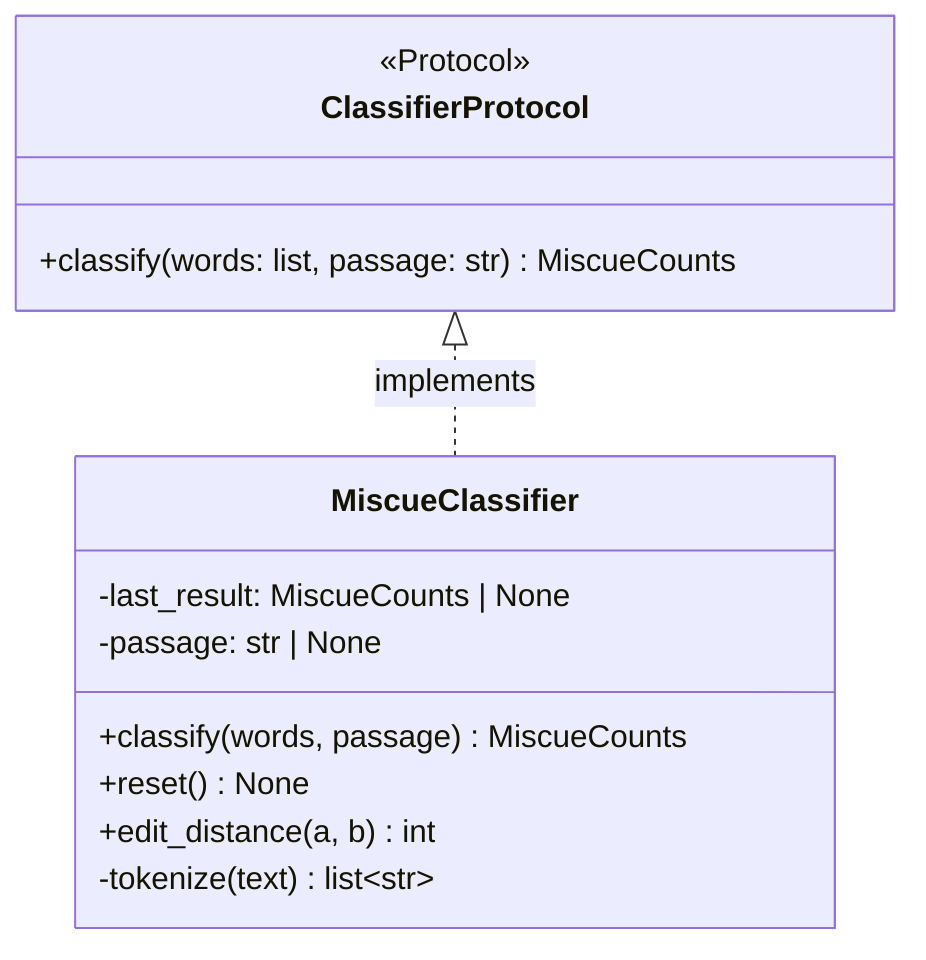
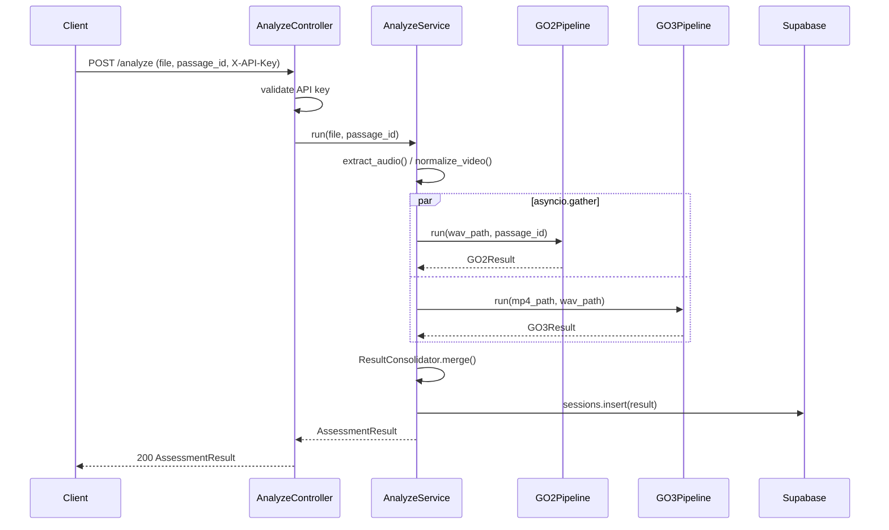
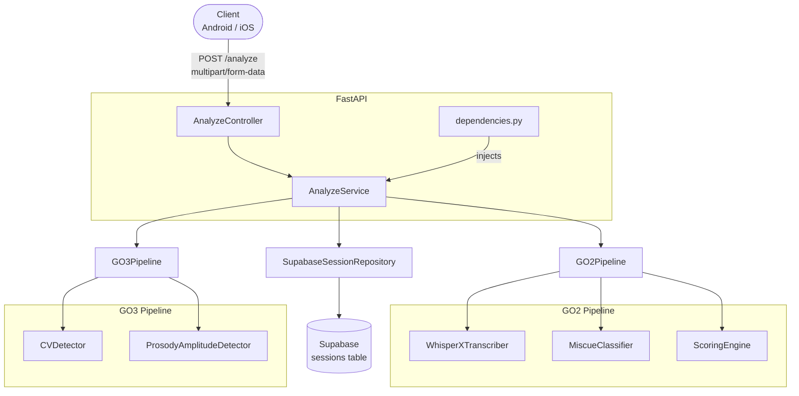
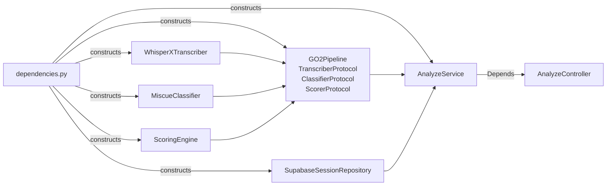

# Design Documentation Skill

After each code generation iteration, produce or update the three documentation
layers below. All files go under `./docs/` in the project root. Use Mermaid for
every diagram — the project uses the VS Code Mermaid Viewer extension.

---

## Folder Structure

```
docs/
  hld/                        ← High-Level Design — one file per domain/feature
    system-overview.md
    go2-pipeline.md
    go3-pipeline.md
    api-layer.md

  lld/                        ← Low-Level Design — one file per class or module
    go2/
      transcriber.md
      miscue-classifier.md
      scoring-engine.md
      go2-pipeline.md
    go3/
      ...
    routers/
      analyze-controller.md
    repositories/
      session-repository.md
    models/
      assessment.md

  uml/                        ← Mermaid diagrams only
    class/                    ← Class + interface relationships
      go2-classes.md
      go3-classes.md
      models.md
      routers.md
    sequence/                 ← Request/data flows
      analyze-flow.md
      go2-pipeline-flow.md
    component/                ← System architecture / wiring
      system-architecture.md
      dependency-graph.md
```

**Naming rule:** kebab-case, matches the Python module name.
`app/services/go2/scoring_engine.py` → `docs/lld/go2/scoring-engine.md`

---

## What Each Layer Contains

### HLD — High-Level Design

One `.md` file per domain (go2, go3, api layer). Use this exact structure:

```markdown
# <Domain> — High-Level Design

## Purpose
<one paragraph>

## Responsibilities
- ...

## Boundaries
- Owns: ...
- Hands off to: ...

## Key Design Decisions
- ...

## Dependencies
- ...

## Diagrams
| Diagram | Link |
|---|---|
| Component / architecture | [system-architecture.md](../uml/component/system-architecture.md) |
| Class relationships | [<domain>-classes.md](../uml/class/<domain>-classes.md) |
| Request flow | [analyze-flow.md](../uml/sequence/analyze-flow.md) |

## Classes in this Domain
| Class | LLD |
|---|---|
| `ClassName` | [lld/go2/class-name.md](../lld/go2/class-name.md) |
```

Keep it under 1 page. HLD is for orientation, not implementation detail.

### LLD — Low-Level Design

One `.md` file per class. Use this exact structure:

```markdown
# `ClassName` — Low-Level Design

## Responsibility
<one sentence — SRP statement>

## Implements
[`ProtocolName`](../../uml/class/<domain>-classes.md) <!-- link to the class diagram -->

## Constructor Dependencies
| Parameter | Type | Injected via |
|---|---|---|
| `transcriber` | `TranscriberProtocol` | `dependencies.py` |

## Methods
| Method | Purpose | Edge cases |
|---|---|---|
| `classify(words, passage)` | Maps words to Phil-IRI categories | Empty transcript → all omissions |

## Diagrams
| Diagram | Link |
|---|---|
| Class diagram | [<domain>-classes.md](../../uml/class/<domain>-classes.md) |
| Sequence / flow | [<flow>.md](../../uml/sequence/<flow>.md) |

## Related
- HLD: [<domain>.md](../../hld/<domain>.md)
- Source: `app/services/<domain>/<module>.py`
```

### UML Diagrams

Each `.md` file in `uml/` contains one or more fenced Mermaid blocks plus a
**Referenced by** section at the bottom linking back to the HLD and LLD files
that embed it:

```markdown
# <Diagram Title>

```mermaid
...
```

## Referenced by
- HLD: `../../hld/<domain>.md`
- LLD: `../../lld/<domain>/<class-name>.md`
```

All paths use **relative links** so they work in VS Code without any config.

---

## Mermaid Templates

### Class Diagram — Protocol + Implementation

````markdown
## GO2 Classifier


````

### Sequence Diagram — /analyze request flow

````markdown
## POST /analyze Flow


````

### Component Diagram — System Architecture

````markdown
## System Architecture


````

### Dependency / Injection Graph

````markdown
## Dependency Wiring


````

---

## What to Generate Per Iteration

When you write a **new class or module**, produce:

| File written | Docs to create/update |
|---|---|
| A Protocol | `uml/class/<domain>-classes.md` — add the interface block |
| A concrete class | `lld/<domain>/<class-name>.md` (new), `uml/class/<domain>-classes.md` (update) |
| A pipeline class | `lld/<domain>/<pipeline>.md`, `uml/sequence/<pipeline>-flow.md` |
| A router/controller | `lld/routers/<controller>.md`, `uml/sequence/analyze-flow.md` |
| A Pydantic model / TypedDict | `lld/models/<model>.md`, `uml/class/models.md` |
| A new domain (go2, go3) | `hld/<domain>.md` (new), `uml/component/system-architecture.md` (update) |
| `dependencies.py` changes | `uml/component/dependency-graph.md` (update) |

You do not need to regenerate unchanged diagrams. Only update diagrams that
the new code affects.

---

## Approval

Show the generated docs (same as code — display in fenced blocks with the
target path labeled) and wait for approval before writing. Docs follow the
same show → approve → write flow as code.

---

## Quality Checks

Before writing any doc file:
- [ ] Mermaid syntax is valid — no unclosed blocks, correct arrow syntax (`-->`, `->>`, `<|..`)
- [ ] Class diagram shows Protocols with `<<Protocol>>` stereotype
- [ ] Sequence diagram uses `par` block for `asyncio.gather` calls
- [ ] Component diagram shows injection boundary clearly (what `dependencies.py` builds)
- [ ] LLD method table covers all public methods
- [ ] HLD is under one page
- [ ] Every HLD has a **Diagrams** table linking to its UML files
- [ ] Every HLD has a **Classes in this Domain** table linking to each LLD
- [ ] Every LLD has a **Diagrams** table and a **Related** section with links back to HLD and source file
- [ ] Every UML file has a **Referenced by** section linking back to HLD/LLD files that use it
- [ ] All links are relative paths (not absolute) — verify they resolve from the file's own location
