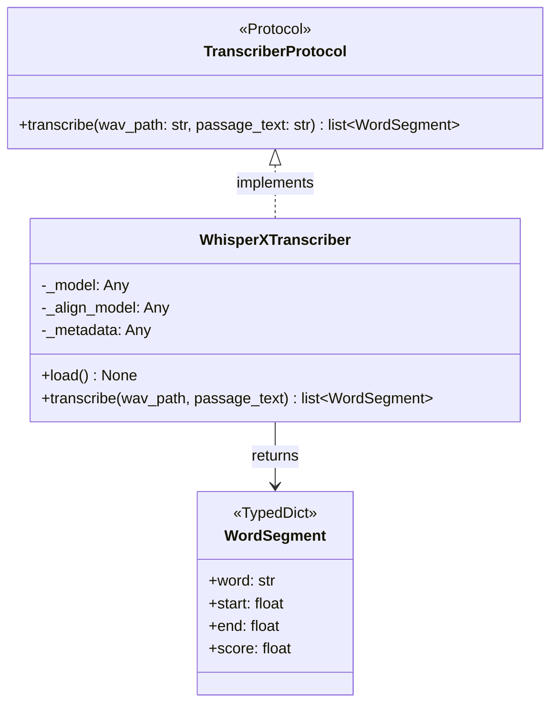

# GO2 Pipeline — Class Diagram

```mermaid
classDiagram
    class TranscriberProtocol {
        <<Protocol>>
        +transcribe(wav_path: str, passage_text: str) list~WordSegment~
    }
    class WhisperXTranscriber {
        -_model: Any
        -_align_model: Any
        -_metadata: Any
        +load() None
        +transcribe(wav_path, passage_text) list~WordSegment~
    }
    class WordSegment {
        <<TypedDict>>
        +word: str
        +start: float
        +end: float
        +score: float
    }
    TranscriberProtocol <|.. WhisperXTranscriber : implements
    WhisperXTranscriber --> WordSegment : returns
```

## Referenced by
- HLD: `../../hld/go2-pipeline.md`
- LLD: `../../lld/go2/transcriber.md`
- LLD: `../../lld/models/transcription.md`
