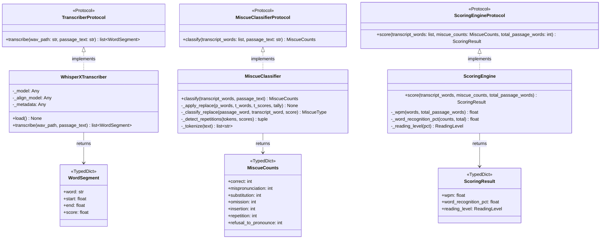

# GO2 Pipeline — Class Diagram

## Referenced by
- HLD: `../../hld/go2-pipeline.md`
- LLD: `../../lld/go2/transcriber.md`
- LLD: `../../lld/go2/miscue-classifier.md`
- LLD: `../../lld/go2/scoring-engine.md`
- LLD: `../../lld/models/transcription.md`
- LLD: `../../lld/models/miscue.md`
- LLD: `../../lld/models/scoring.md`
