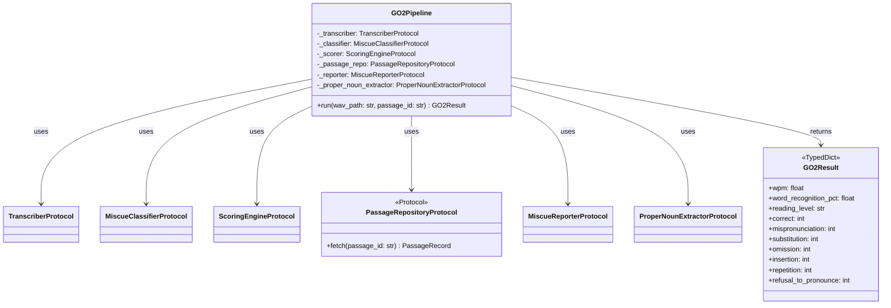

# GO2 Pipeline — Class Diagram

```mermaid
classDiagram
    class TranscriberProtocol {
        <<Protocol>>
        +transcribe(wav_path: str, passage_text: str) list~WordSegment~
    }
    class WhisperXTranscriber {
        -_model: Any
        -_align_model: Any
        -_metadata: Any
        +load() None
        +transcribe(wav_path, passage_text) list~WordSegment~
    }
    class WordSegment {
        <<TypedDict>>
        +word: str
        +start: float
        +end: float
        +score: float
    }
    class MiscueClassifierProtocol {
        <<Protocol>>
        +classify(transcript_words: list, passage_text: str, proper_nouns: list~str~ | None) MiscueCounts
        +detail(transcript_words: list, passage_text: str, proper_nouns: list~str~ | None) list~MiscueDetail~
    }
    class MiscueClassifier {
        +classify(transcript_words, passage_text, proper_nouns) MiscueCounts
        +detail(transcript_words, passage_text, proper_nouns) list~MiscueDetail~
        -_align(transcript_words, passage_text, proper_nouns) list~MiscueDetail~
        -_align_replace(p_words, t_segments, proper_set) list~MiscueDetail~
        -_classify_replace(passage_word, transcript_word, score, proper_set) MiscueType
        -_detect_repetitions(words) tuple
        -_tokenize(text) list~str~
    }
    class MiscueCounts {
        <<TypedDict>>
        +correct: int
        +mispronunciation: int
        +substitution: int
        +omission: int
        +insertion: int
        +repetition: int
        +refusal_to_pronounce: int
    }
    class MiscueDetail {
        <<TypedDict>>
        +miscue_type: MiscueType
        +passage_word: str | None
        +transcript_word: str | None
        +start: float | None
        +end: float | None
    }
    class ProperNounExtractorProtocol {
        <<Protocol>>
        +extract(passage_text: str) list~str~
    }
    class CapitalizationProperNounExtractor {
        +extract(passage_text) list~str~
    }
    class MiscueReporterProtocol {
        <<Protocol>>
        +report(passage_id: str, details: list) None
    }
    class MiscueReporter {
        +report(passage_id, details) None
        -_format(detail) str
        -_word(word) str
        -_timing(start, end) str
    }
    class ScoringEngineProtocol {
        <<Protocol>>
        +score(transcript_words: list, miscue_counts: MiscueCounts, total_passage_words: int) ScoringResult
    }
    class ScoringEngine {
        +score(transcript_words, miscue_counts, total_passage_words) ScoringResult
        -_wpm(words, total_passage_words) float
        -_word_recognition_pct(counts, total) float
        -_reading_level(pct) ReadingLevel
    }
    class ScoringResult {
        <<TypedDict>>
        +wpm: float
        +word_recognition_pct: float
        +reading_level: ReadingLevel
    }
    TranscriberProtocol <|.. WhisperXTranscriber : implements
    WhisperXTranscriber --> WordSegment : returns
    MiscueClassifierProtocol <|.. MiscueClassifier : implements
    MiscueClassifier --> MiscueCounts : returns
    MiscueClassifier --> MiscueDetail : returns
    ProperNounExtractorProtocol <|.. CapitalizationProperNounExtractor : implements
    MiscueReporterProtocol <|.. MiscueReporter : implements
    MiscueReporter --> MiscueDetail : prints
    ScoringEngineProtocol <|.. ScoringEngine : implements
    ScoringEngine --> ScoringResult : returns
```

## GO2Pipeline

## Referenced by
- HLD: `../../hld/go2-pipeline.md`
- LLD: `../../lld/go2/transcriber.md`
- LLD: `../../lld/go2/miscue-classifier.md`
- LLD: `../../lld/go2/miscue-reporter.md`
- LLD: `../../lld/go2/proper-noun-extractor.md`
- LLD: `../../lld/models/proper-noun.md`
- LLD: `../../lld/go2/scoring-engine.md`
- LLD: `../../lld/go2/go2-pipeline.md`
- LLD: `../../lld/models/transcription.md`
- LLD: `../../lld/models/miscue.md`
- LLD: `../../lld/models/scoring.md`
