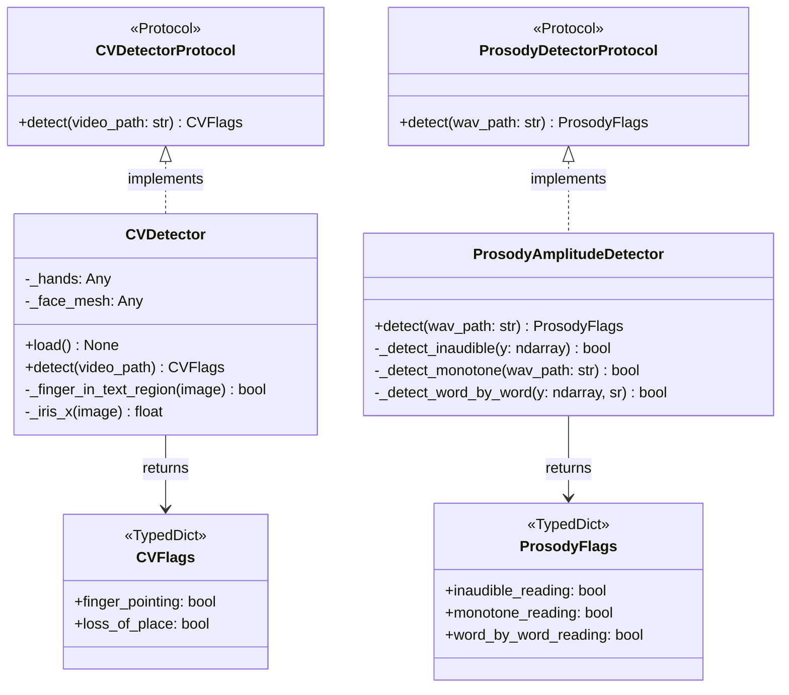

# GO3 Pipeline — Class Diagram

## Referenced by
- HLD: `../../hld/go3-pipeline.md`
- LLD: `../../lld/go3/cv-detector.md`
- LLD: `../../lld/models/cv-detector.md`
- LLD: `../../lld/go3/prosody-detector.md`
- LLD: `../../lld/models/prosody-detector.md`
