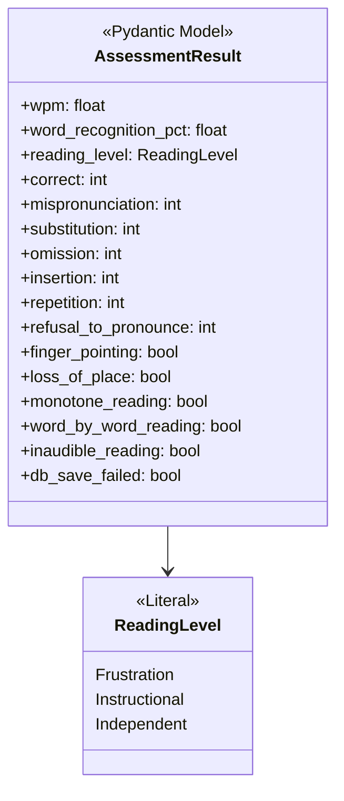
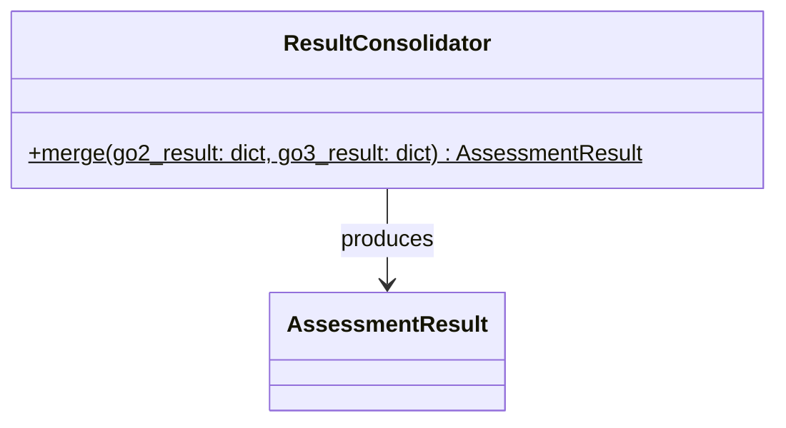
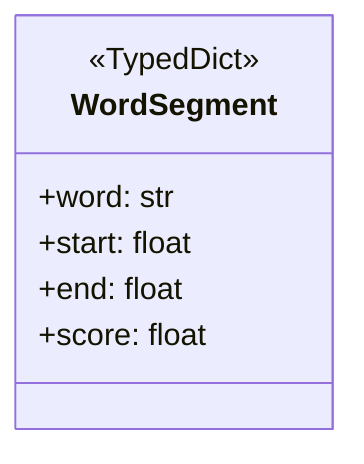
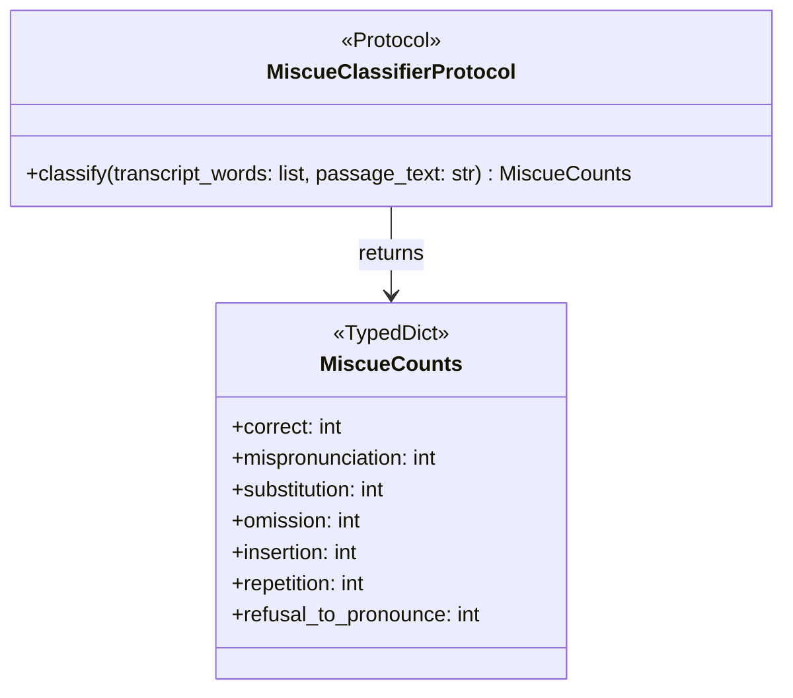
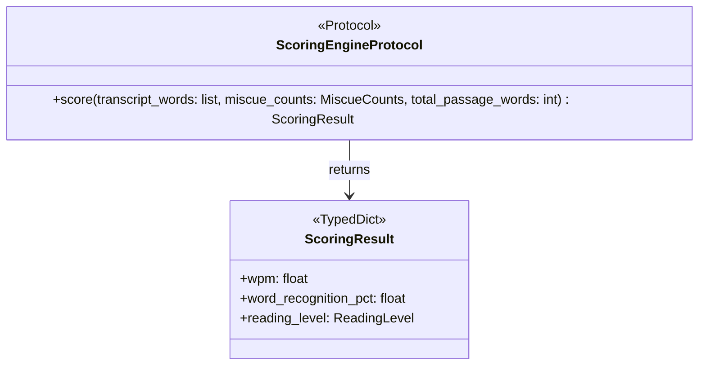
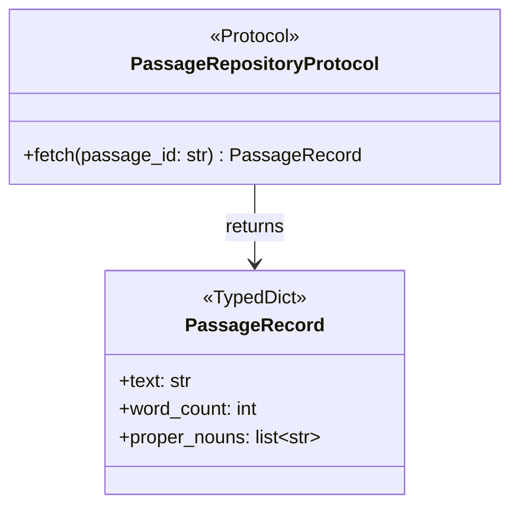
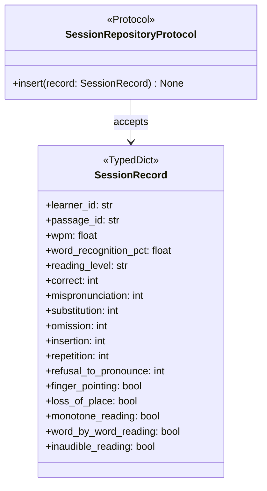
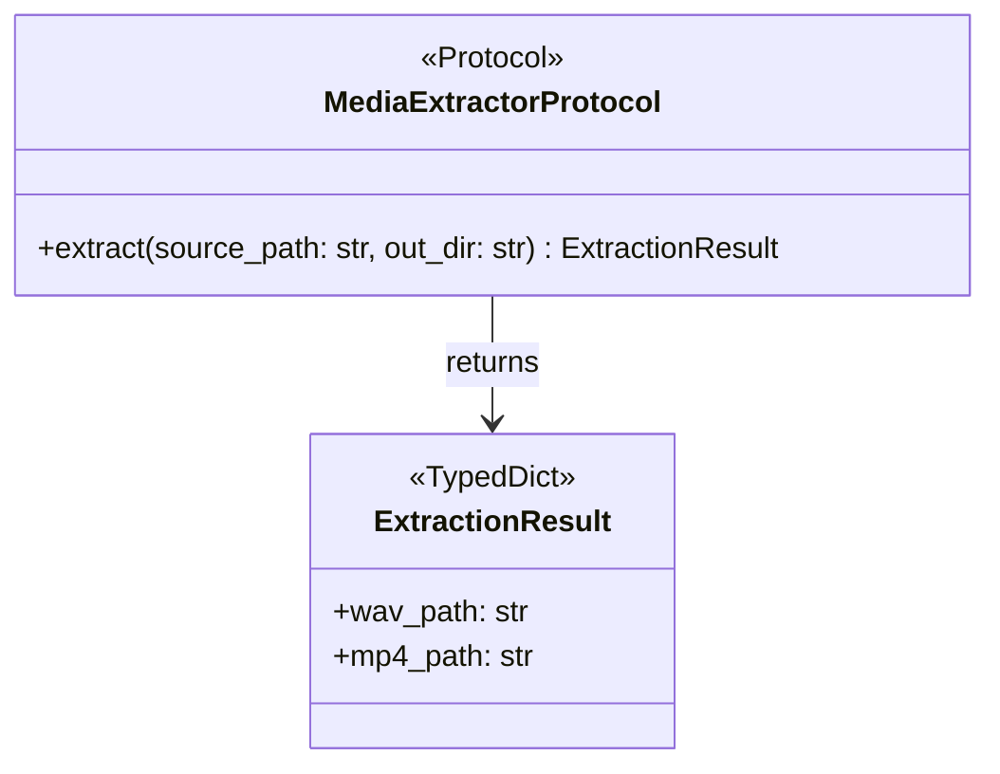
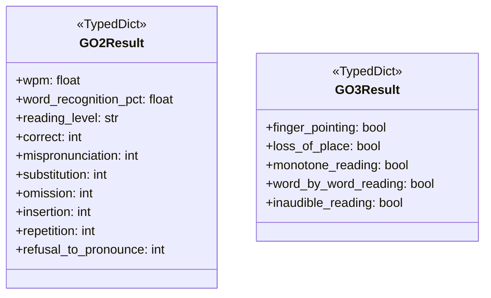

# Models — Class Diagram

## AssessmentResult (updated — RR-020)

## ResultConsolidator

## WordSegment

## MiscueCounts

## ScoringResult

## PassageRecord + PassageRepositoryProtocol

## SessionRecord + SessionRepositoryProtocol

## ExtractionResult + MediaExtractorProtocol

## GO2Result + GO3Result

## Referenced by
- LLD: `../../lld/models/assessment.md`
- LLD: `../../lld/utils/result-consolidator.md`
- LLD: `../../lld/routers/analyze-controller.md`
- LLD: `../../lld/models/transcription.md`
- LLD: `../../lld/models/miscue.md`
- LLD: `../../lld/models/scoring.md`
- LLD: `../../lld/models/passage.md`
- LLD: `../../lld/models/session.md`
- LLD: `../../lld/models/media-extractor-model.md`
- LLD: `../../lld/models/pipeline-results.md`
