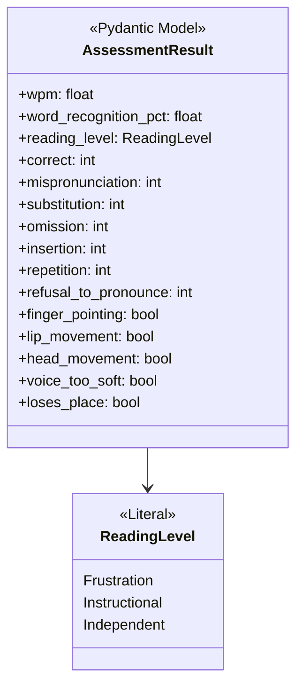
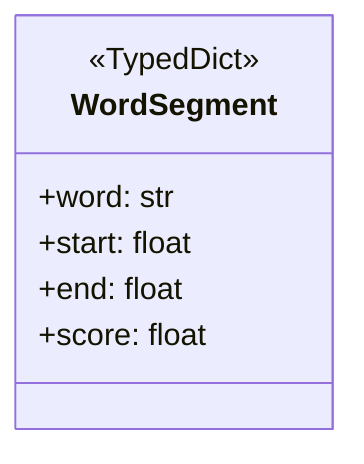
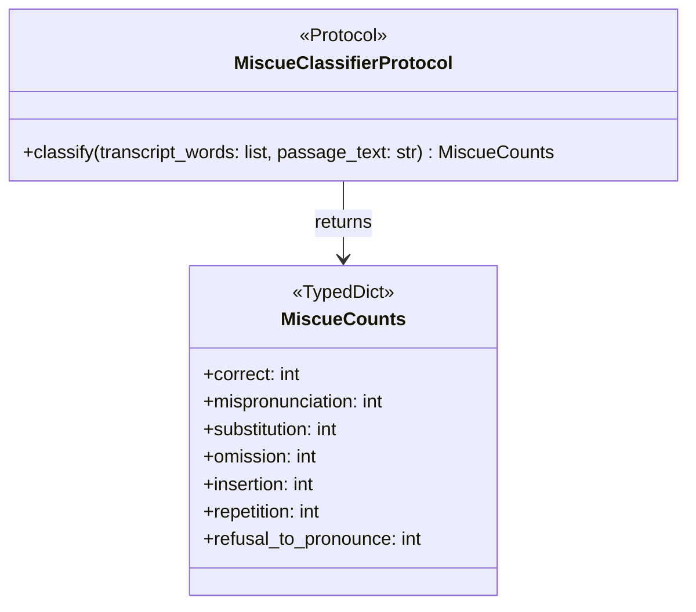

# Models — Class Diagram

## AssessmentResult

## WordSegment

## MiscueCounts

## Referenced by
- LLD: `../../lld/models/assessment.md`
- LLD: `../../lld/routers/analyze-controller.md`
- LLD: `../../lld/models/transcription.md`
- LLD: `../../lld/models/miscue.md`
