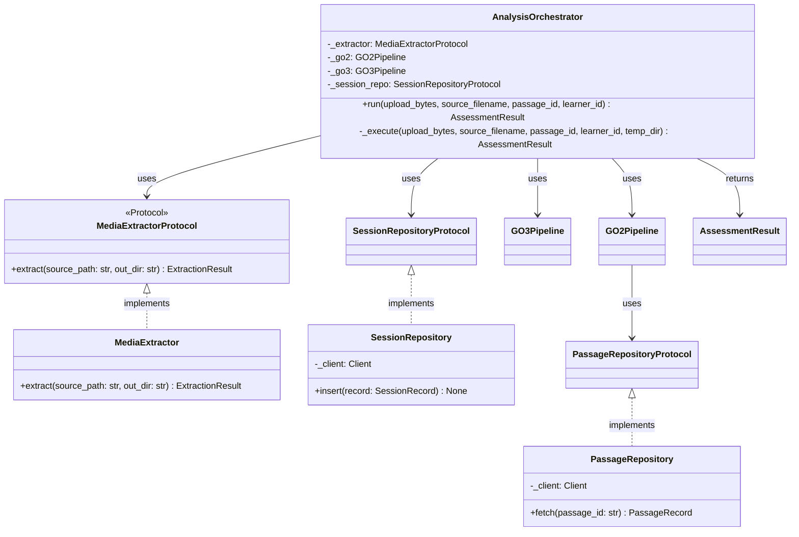

# Orchestrator — Class Diagram

## AnalysisOrchestrator

## Referenced by
- HLD: `../../hld/api-layer.md`
- LLD: `../../lld/services/analysis-orchestrator.md`
- LLD: `../../lld/services/media-extractor.md`
- LLD: `../../lld/repositories/session-repository.md`
- LLD: `../../lld/repositories/passage-repository.md`
