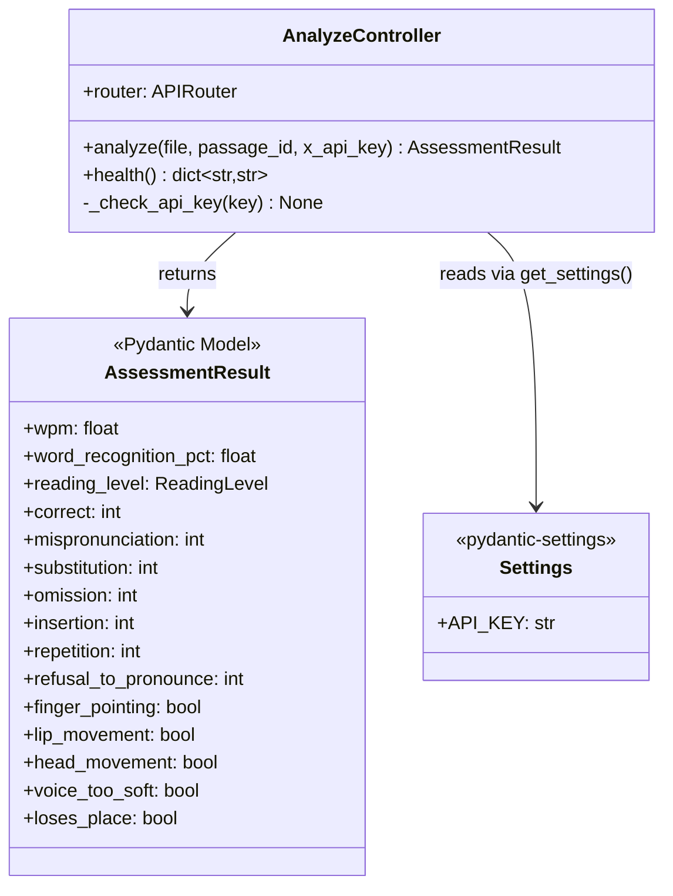

# Routers — Class Diagram

## AnalyzeController

```mermaid
classDiagram
    class AnalyzeController {
        +router: APIRouter
        +analyze(file, passage_id, x_api_key) AssessmentResult
        +health() dict~str,str~
        -_check_api_key(key) None
    }
    class AssessmentResult {
        <<Pydantic Model>>
        +wpm: float
        +word_recognition_pct: float
        +reading_level: ReadingLevel
        +correct: int
        +mispronunciation: int
        +substitution: int
        +omission: int
        +insertion: int
        +repetition: int
        +refusal_to_pronounce: int
        +finger_pointing: bool
        +lip_movement: bool
        +head_movement: bool
        +voice_too_soft: bool
        +loses_place: bool
    }
    class Settings {
        <<pydantic-settings>>
        +API_KEY: str
    }
    AnalyzeController --> AssessmentResult : returns
    AnalyzeController --> Settings : reads via get_settings()
```

## Referenced by
- HLD: `../../hld/api-layer.md`
- LLD: `../../lld/routers/analyze-controller.md`
