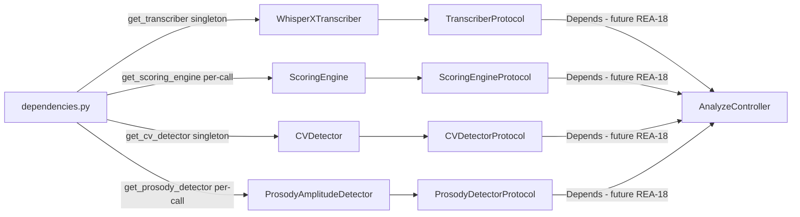

# Dependency Wiring — Component Graph

```mermaid
flowchart LR
    deps[dependencies.py]

    deps -->|get_transcriber singleton| T[WhisperXTranscriber]
    deps -->|get_scoring_engine per-call| S[ScoringEngine]
    deps -->|get_cv_detector singleton| CV[CVDetector]
    deps -->|get_prosody_detector per-call| PA[ProsodyAmplitudeDetector]

    T --> Proto1[TranscriberProtocol]
    S --> Proto2[ScoringEngineProtocol]
    CV --> Proto3[CVDetectorProtocol]
    PA --> Proto4[ProsodyDetectorProtocol]

    Proto1 -->|Depends - future REA-18| Ctrl[AnalyzeController]
    Proto2 -->|Depends - future REA-18| Ctrl
    Proto3 -->|Depends - future REA-18| Ctrl
    Proto4 -->|Depends - future REA-18| Ctrl
```

## Referenced by
- HLD: `../../hld/go2-pipeline.md`
- HLD: `../../hld/go3-pipeline.md`
