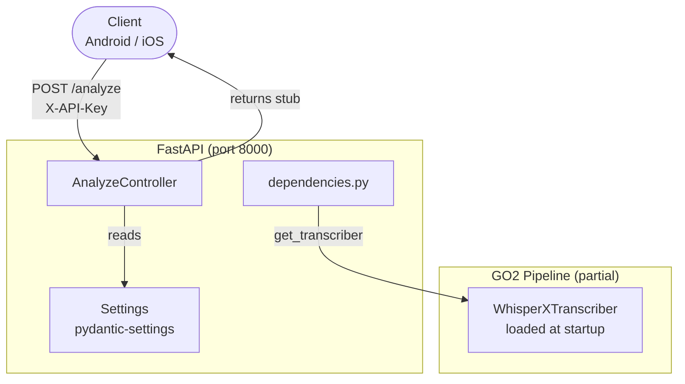
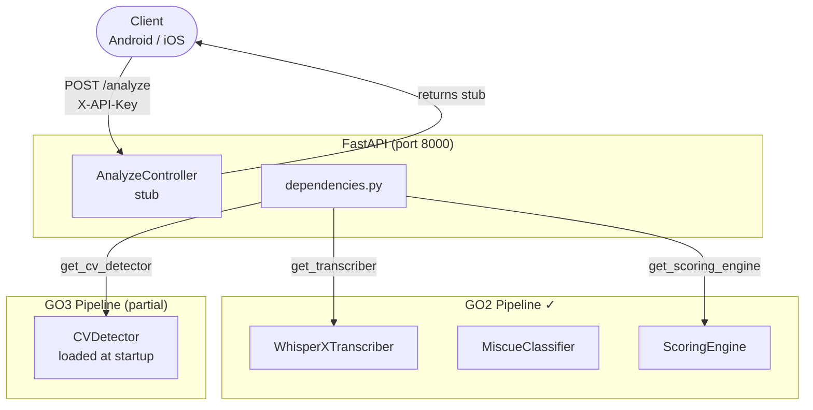
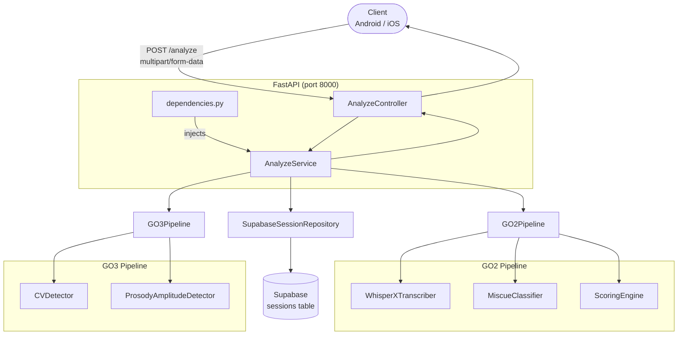

# System Architecture — Component Diagram

## Current (RR-021 — WhisperX wired at startup)

## Current (REA-22 — GO3 CVDetector wired)

## Target (RR-020 — after full wiring)

## Referenced by
- HLD: `../../hld/system-overview.md`
