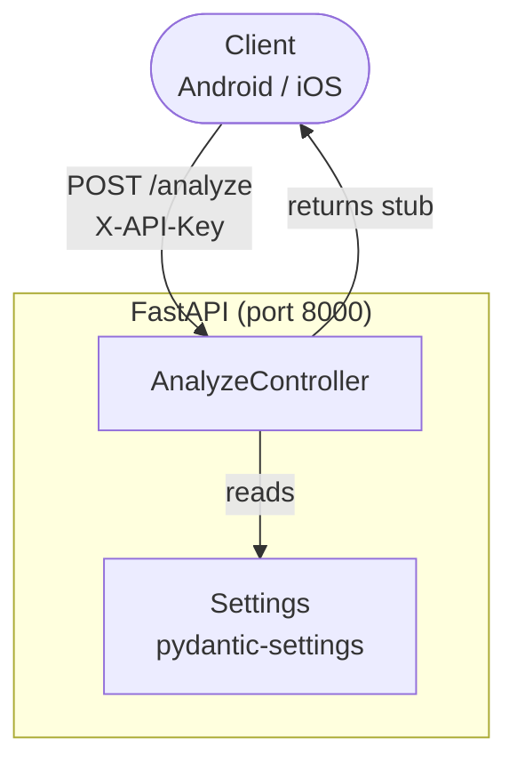

# System Architecture — Component Diagram

## Current (RR-004 Stub)



## Target (RR-020 — after full wiring)

```mermaid
flowchart TD
    Client([Client\nAndroid / iOS]) -->|POST /analyze\nmultipart/form-data| Controller

    subgraph FastAPI["FastAPI (port 8000)"]
        Controller[AnalyzeController]
        Service[AnalyzeService]
        Deps[dependencies.py]
    end

    subgraph GO2["GO2 Pipeline"]
        T[WhisperXTranscriber]
        C[MiscueClassifier]
        S[ScoringEngine]
    end

    subgraph GO3["GO3 Pipeline"]
        CV[CVDetector]
        PA[ProsodyAmplitudeDetector]
    end

    Deps -->|injects| Service
    Controller --> Service
    Service --> GO2Pipeline --> T & C & S
    Service --> GO3Pipeline --> CV & PA
    Service --> Repo[SupabaseSessionRepository]
    Repo --> DB[(Supabase\nsessions table)]
    Service -->> Controller
    Controller -->> Client
```

## Referenced by
- HLD: `../../hld/system-overview.md`
