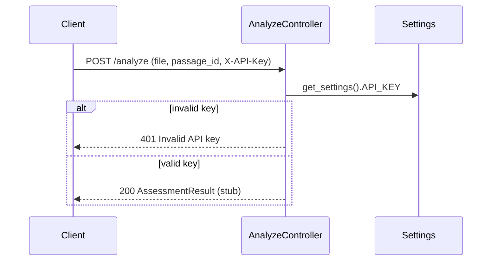
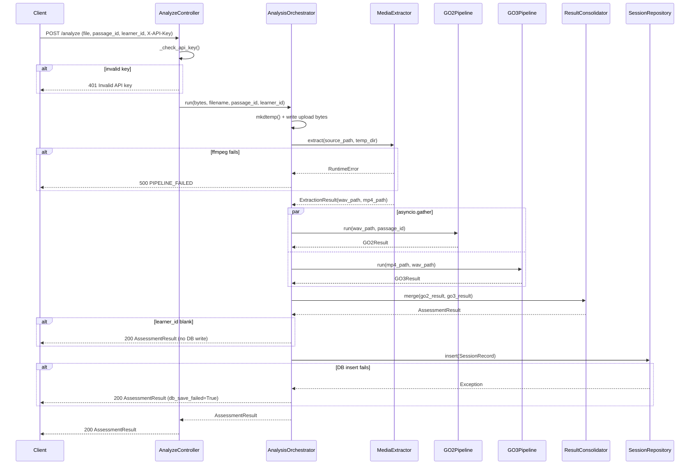

# POST /analyze — Sequence Diagram

## Stub Flow (RR-004)

## Full Flow (RR-020 — implemented)

## Referenced by
- HLD: `../../hld/api-layer.md`
- HLD: `../../hld/system-overview.md`
- LLD: `../../lld/routers/analyze-controller.md`
- LLD: `../../lld/services/analysis-orchestrator.md`
