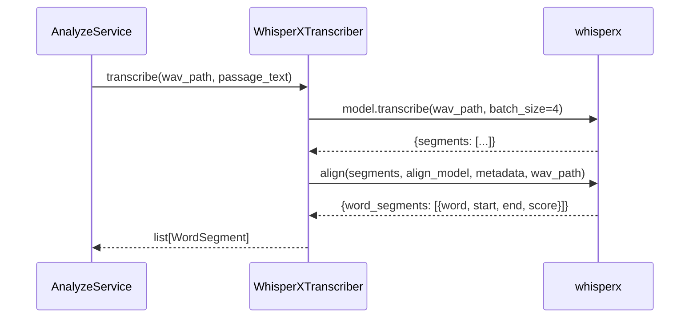
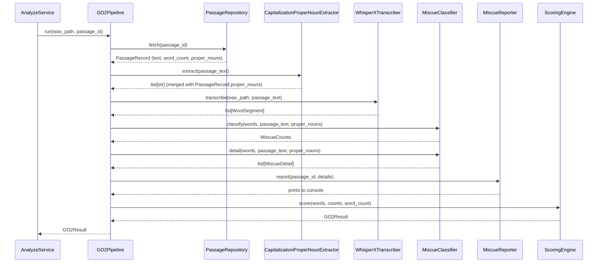

# GO2 Pipeline — Sequence Diagram

## Transcription Flow (RR-021)

## Full GO2 Flow (RR-022 + RR-023 — to be updated)

## Referenced by
- HLD: `../../hld/go2-pipeline.md`
- LLD: `../../lld/go2/transcriber.md`
