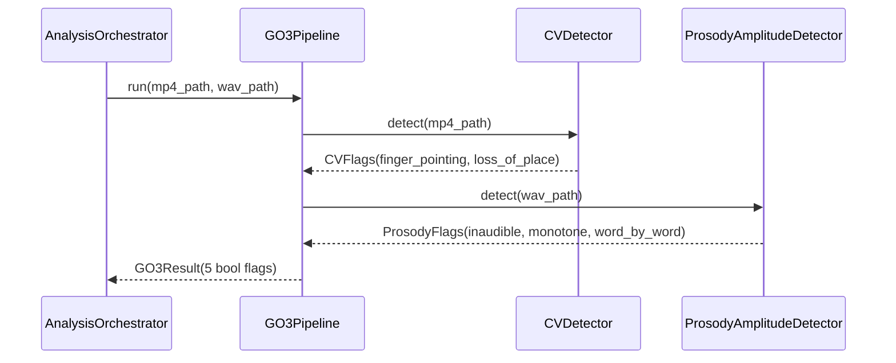

# GO3 Pipeline — Sequence Diagram

```mermaid
sequenceDiagram
    participant AnalysisOrchestrator
    participant GO3Pipeline
    participant CVDetector
    participant ProsodyAmplitudeDetector

    AnalysisOrchestrator->>GO3Pipeline: run(mp4_path, wav_path)
    GO3Pipeline->>CVDetector: detect(mp4_path)
    CVDetector-->>GO3Pipeline: CVFlags(finger_pointing, loss_of_place)
    GO3Pipeline->>ProsodyAmplitudeDetector: detect(wav_path)
    ProsodyAmplitudeDetector-->>GO3Pipeline: ProsodyFlags(inaudible, monotone, word_by_word)
    GO3Pipeline-->>AnalysisOrchestrator: GO3Result(5 bool flags)
```

## Referenced by
- HLD: `../../hld/go3-pipeline.md`
- LLD: `../../lld/go3/go3-pipeline.md`
